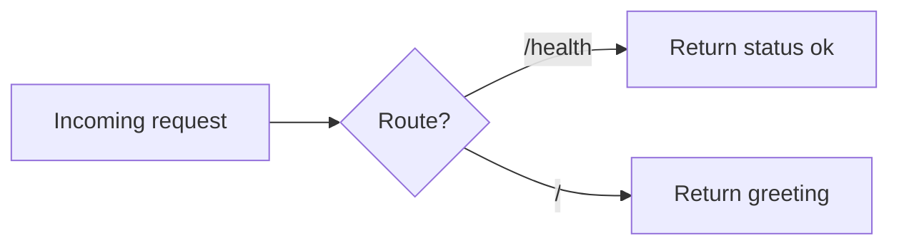

## What does this PR do?

<!-- One or two sentences describing the change and why it is needed. -->

## How does it work?

<!--
Explain the logic so a reviewer does not have to reverse-engineer it.
For any non-trivial flow, include a Mermaid diagram, for example:

-->

## Test plan

- [ ] `npm run build` succeeds
- [ ] Playwright smoke tests pass (`npm run test:e2e`)
- [ ] Manually verified the change locally

## Checklist

- [ ] No new dead code or unused dependencies introduced (Dark Matter clean)
- [ ] Docs updated, or N/A
- [ ] Breaking changes called out above, or N/A
