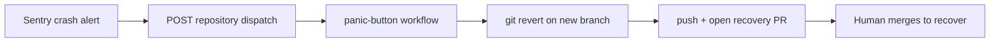

# Panic-Button: instant production recovery

The Panic-Button opens a **revert PR automatically** when an external monitoring
tool (e.g. Sentry) detects a production crash, so the team can recover in one
click.

## How it is triggered

The native mechanism is a **repository dispatch event**: the alerting tool calls GitHub's repository dispatch API, which triggers the panic-button workflow. The `panic-button` job (in `.github/workflows/panic-button.yml`) runs when a repository dispatch event of type `panic_button` is received.

### 1. Point your alerting tool at GitHub
Configure the alert (e.g. a Sentry webhook / integration) to POST:

```bash
curl -X POST \
  -H "Authorization: token <GITHUB_TOKEN>" \
  -H "Accept: application/vnd.github+json" \
  "https://api.github.com/repos/VIVAAN-DHAWAN/talos/dispatches" \
  -d '{"event_type":"panic_button","client_payload":{"sha":"<bad_commit_sha>","reason":"Sentry: unhandled exception spike"}}'
```

If `sha` is omitted in the payload, the job reverts `HEAD` of the default branch.

### 2. Provide a write token
The job needs the built-in `GITHUB_TOKEN` to push branches and open PRs. Ensure that GitHub Actions has write permission under Settings > Actions > General > Workflow permissions.

## What it does

1. Checks out the tip of the default branch.
2. Resolves and validates the commit to revert.
3. Runs `git revert` on a fresh `panic/revert-*` branch (aborts on conflict).
4. Pushes the branch and opens a recovery PR using the GitHub CLI (`gh`).

It never pushes to `main` directly: a human merges the revert to recover.

## Flow


