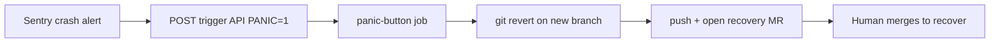

# Panic-Button: instant production recovery

The Panic-Button opens a **revert MR automatically** when an external monitoring
tool (e.g. Sentry) detects a production crash, so the team can recover in one
click.

## How it is triggered

GitLab has no inbound "run my code" webhook. The native mechanism is a
**pipeline trigger token**: the alerting tool calls GitLab's trigger API, which
starts a pipeline. The `panic-button` job (in `.gitlab-ci.yml`) only runs for
trigger pipelines that set `PANIC=1`.

### 1. Create a trigger token
Settings > CI/CD > Pipeline trigger tokens > Add new token.

### 2. Point your alerting tool at GitLab
Configure the alert (e.g. a Sentry webhook / integration) to POST:

```bash
curl -X POST \
  "https://gitlab.com/api/v4/projects/<PROJECT_ID>/trigger/pipeline" \
  -F token="<TRIGGER_TOKEN>" \
  -F ref="main" \
  -F "variables[PANIC]=1" \
  -F "variables[PANIC_REVERT_SHA]=<bad_commit_sha>" \
  -F "variables[PANIC_REASON]=Sentry: unhandled exception spike"
```

If `PANIC_REVERT_SHA` is omitted, the job reverts `HEAD` of the default branch.

### 3. Provide a write token
The job needs `PANIC_TOKEN` (or it falls back to `DARK_MATTER_TOKEN`) with
`api` + `write_repository` scopes, set as a **masked** CI/CD variable.

## What it does

1. Checks out the tip of the default branch.
2. Resolves and validates the commit to revert.
3. Runs `git revert` on a fresh `panic/revert-*` branch (aborts on conflict).
4. Pushes the branch and opens a recovery MR via the GitLab API.

It never pushes to `main` directly: a human merges the revert to recover.

## Flow


